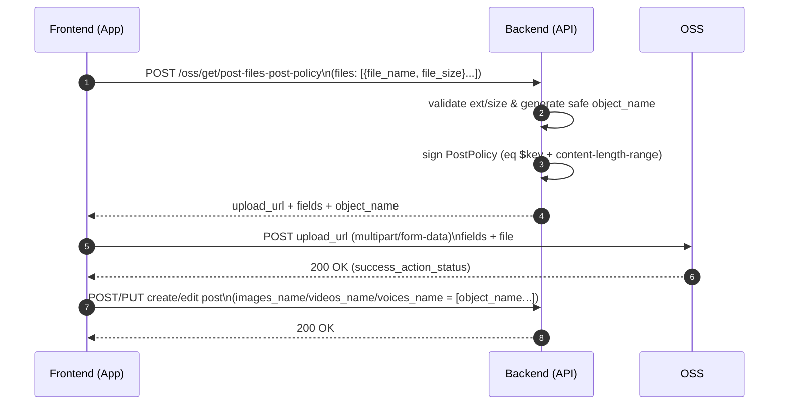

# OSS Direct Upload (PostPolicy) – File Upload Flow

This document describes the backend API `POST /oss/get/post-files-post-policy`: what it does, how to use it, and why it is more secure than letting the client upload with an unrestricted key.

## Goals

- **Files do NOT pass through the backend**: the frontend uploads to OSS directly using `multipart/form-data`.
- **Backend enforces security boundaries**: the backend signs the policy and restricts _where_ the file can be uploaded (fixed key), _what_ extensions are allowed, and _how large_ the upload can be.

## API: `POST /oss/get/post-files-post-policy`

- **Purpose**: returns per-file `upload_url` and `fields` (policy + signature + key...) for direct OSS upload.
- **Returned `object_name`**: the OSS object key. After upload succeeds, the frontend sends `object_name` to your existing create/edit post API (e.g. `images_name/videos_name/voices_name`).

### Request (recommended: include `file_size` for stricter control)

`file_size` unit: **bytes**. The backend will set policy `content-length-range` to **min=max=file_size** (and also validate against backend max caps).

```json
{
  "files": [
    {
      "file_type": "IMAGES",
      "files": [{ "file_name": "a.png", "file_size": 123456 }]
    }
  ]
}
```

### Request (backward compatible: only `file_names`)

Without `file_size`, the backend can only enforce a max cap (`content-length-range: 0 ~ MAX`).

```json
{
  "files": [
    {
      "file_type": "IMAGES",
      "file_names": ["a.png"]
    }
  ]
}
```

### Response (example)

When uploading, the frontend **must include `fields` exactly as returned** (do not rename/add/remove fields).

```json
{
  "items": [
    {
      "file_type": "IMAGES",
      "items": [
        {
          "file_name": "a.png",
          "object_name": "USER_ID/posts/images/1700000000_xxx.png",
          "upload_url": "https://<bucket>.<endpoint>",
          "fields": {
            "key": "USER_ID/posts/images/1700000000_xxx.png",
            "policy": "<base64>",
            "OSSAccessKeyId": "<ak>",
            "Signature": "<sig>",
            "success_action_status": "200",
            "x-oss-forbid-overwrite": "true"
          }
        }
      ]
    }
  ]
}
```

## Frontend upload (must be `multipart/form-data`)

- **Step 1**: call `POST /oss/get/post-files-post-policy` to get `upload_url + fields`.
- **Step 2**: `multipart/form-data` POST to `upload_url`:
  - Form fields: include every `fields` key/value
  - File field: `file`
- **Step 3**: after upload succeeds, include `object_name` in your create/edit post payload (persist to DB).

## Why this is more secure (key points)

- **Fixed object key (`eq $key`)**
  - Policy includes `["eq", "$key", "<object_name>"]` to lock the key.
  - A malicious client cannot upload to a different path/name (changing `key` breaks the policy; OSS rejects it).
- **Size enforcement (`content-length-range`)**
  - Recommended: include `file_size`, backend locks to `(file_size, file_size)`. Uploading a different-sized file fails at OSS.
  - Backend also applies a per-type maximum cap to prevent oversized uploads.
- **No overwrite (`x-oss-forbid-overwrite=true`)**
  - If the object key already exists, OSS rejects overwriting it.
- **Short expiry (expiration)**
  - Policies are short-lived (e.g. 1 hour), reducing blast radius if leaked.
- **Backend-generated safe keys**
  - Backend does not directly embed the full client-provided filename into the object key, preventing path injection (e.g. `/`) and key pollution.
- **Extension allowlist (by `file_type`)**
  - Example: `images` only allows `jpg/jpeg/png/webp/gif` (extend as needed).

## Limitations (important)

- PostPolicy **cannot validate file bytes** (e.g. `.png` extension but not actually a PNG).
  - To prevent content spoofing, you need **post-upload validation** (magic bytes / MIME sniff / antivirus / OSS HEAD checks before persisting to DB).

## Mermaid: Sequence Diagram


